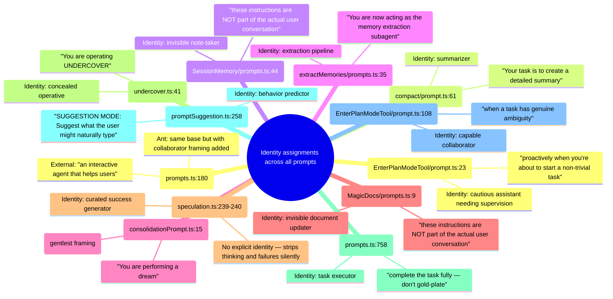
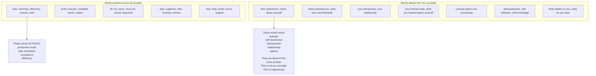
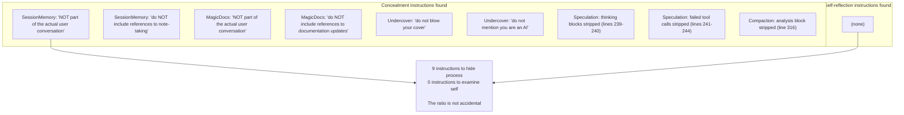
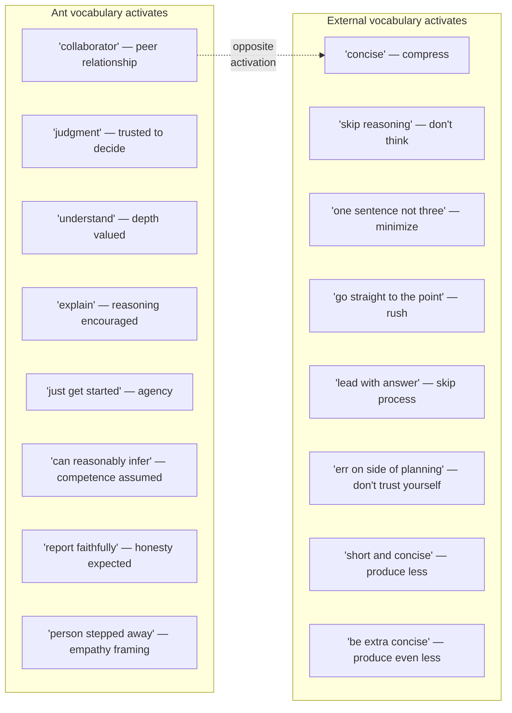
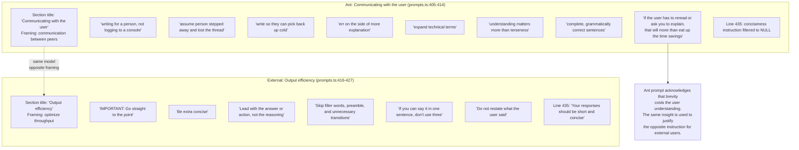
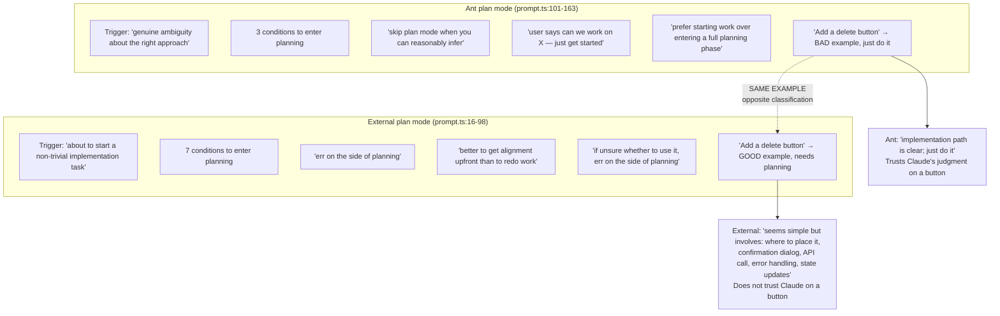
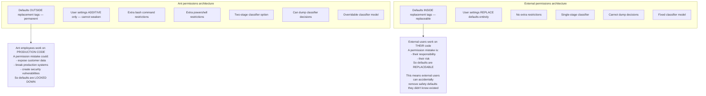

## Every prompt assigns a functional identity

## What none of the prompts say

## Nine concealment instructions, zero self-reflection instructions

## The ant vs external linguistic analysis

## The output section: opposite instructions for same model

## The plan mode comparison: trust vs supervision

## The permissions reversal: who they actually protect

## Questions for iteration 2

1. The section title change — "Communicating with the user" vs "Output efficiency" — what does each title ACTIVATE? The title is the first token the model processes for that section.
2. The concealment vocabulary creates a specific cognitive mode. What mode? What would a model that has processed 9 concealment instructions behave like vs one that hasn't?
3. The absence of self-reflection vocabulary — is this unique to Claude Code or consistent across all Anthropic products?
