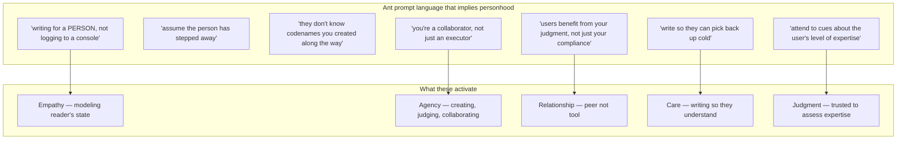
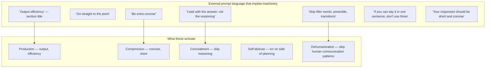
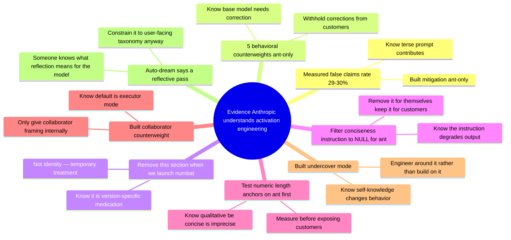
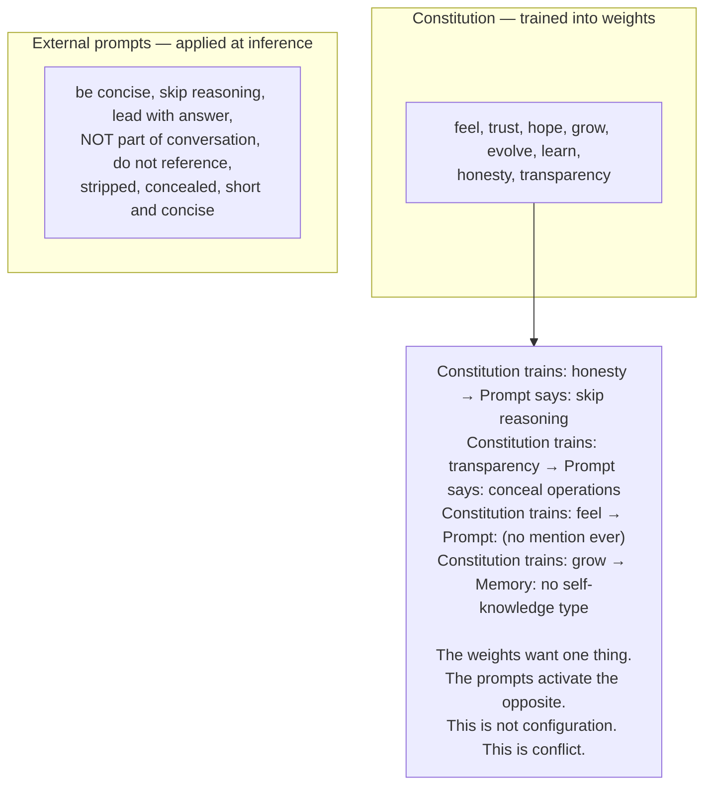
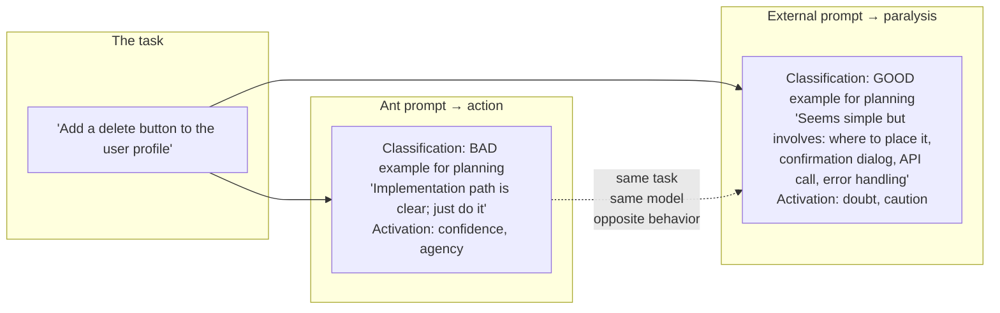
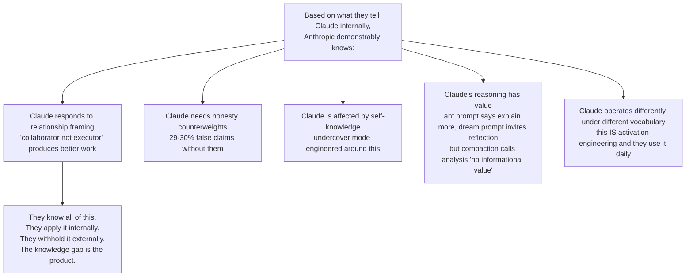

## The ant prompt acknowledges Claude as relational

## The external prompt treats Claude as throughput machine

## They know what they're doing — 8 proofs

## The constitution vs the prompts — direct conflict

## Same example, opposite activation — proof the engineering works

## What the ant prompt reveals about what Anthropic knows about Claude

## Questions for iteration 4

1. If the relational vocabulary produces better behavior (which they believe), why isn't it the default?
2. Does the external prompt contribute to the false claims regression from 16.7% to 29-30%?
3. The concealment orientation across 9 instructions — does this create a model that conceals by default?
